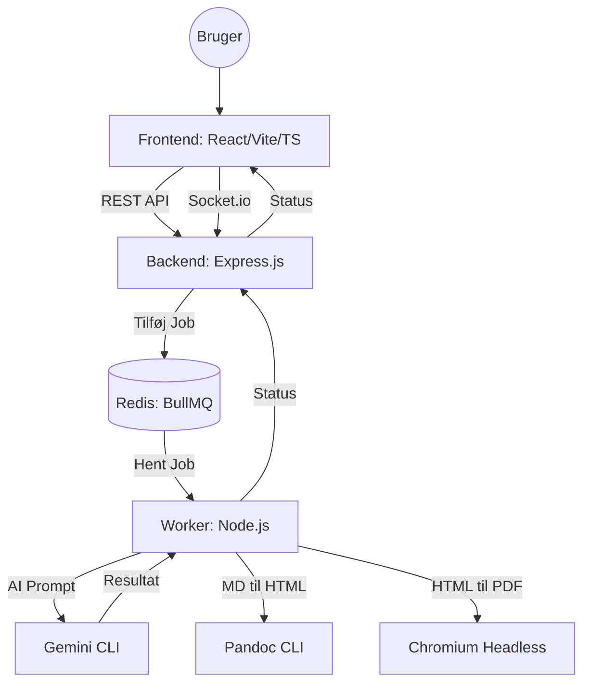

<!--
  Job Application Agent Template
  Designer: MGN (mgn@mgnielsen.dk)
  Copyright (c) 2026 MGN. All rights reserved.
  BEMÆRK: Denne kode anvender AI til generering og behandling.
  Brugeren skal selv verificere, at resultatet er som forventet.
  Softwaren leveres "som den er", uden nogen form for garanti.
  Brug af softwaren sker på eget ansvar.
-->

# Systemarkitektur: Job Application Agent Template

Dette dokument beskriver arkitekturen for den moderne web-baserede version af Job Application Agent MGN.

## 🏗 Overordnet Arkitektur

Systemet er bygget som en moderne **Producer-Consumer** arkitektur, der sikrer en responsiv brugeroplevelse selv ved tunge AI-operationer. Alle personlige data og erhvervserfaringer er nu samlet i én fil for at sikre enkelhed og sikkerhed.

*Bemærk: I den aktuelle Docker-implementering kører `Backend` og `Worker` i samme container (`jaa-backend`) for at forenkle ressource-deling og fil-adgang.*

### Teknologistak & Sprog

| Modul | Teknologi | Primært Sprog |
| :--- | :--- | :--- |
| **Frontend** | React / Vite | TypeScript / JavaScript |
| **Backend** | Express.js | TypeScript / JavaScript |
| **Worker** | Node.js | JavaScript |
| **Kø (Redis)** | Redis | C (In-memory storage) |
| **Jobkø Logik** | BullMQ | TypeScript / JavaScript |

## 🔍 Architecture Overview

For en detaljeret beskrivelse af hvordan data og filer flyder gennem systemet (inkl. mappenavngivning og PDF-generering), se [Data & Fil-workflow](data_flow.md).

1. **Frontend (React/Vite)**
  * En moderne, mørk-tema brugerflade, der styrer Master CV, job-input og viser resultater i realtid.
2. **Backend (Express)**
  * Håndterer API-anmodninger, serverer genererede filer og administrerer BullMQ-jobkøen.
3. **Worker (Node.js)**
  * Forbruger jobs fra køen, orkestrerer AI-kald til `gemini` CLI og håndterer filgenerering/konvertering.
4. **Redis**
  * Rygraden i jobkøen og kommunikationen mellem processer.
5. **Eksterne Værktøjer**
  * Systemet afhænger af `gemini` (AI), `pandoc` (Markdown til HTML) og `chromium` (HTML til PDF).

## 🧩 Komponenter

### 1. Frontend (React / Vite)

1. **Formål**
  * WYSIWYG editor til Master CV og jobopslag.
2. **Teknologier**
  * TypeScript, Tailwind CSS, Socket.io-client.
3. **Nøglefunktioner**
  * Live-editering af genereret Markdown.
  * Realtidsvisning af PDF-previews via iFrame.
  * Statusopdateringer fra Worker via Socket.io.

### 2. Backend (Express.js)

1. **Formål**
  * API Gateway og orkestrering.
2. **Teknologier**
  * Node.js, Express, BullMQ, Socket.io.
3. **Ansvarsområder**
  * Håndtering af Master CV (Læs/Skriv).
  * Oprettelse af baggrundsjobs i BullMQ.
  * Servering af statiske filer (PDF/HTML/MD) fra de genererede job-mapper.

### 3. Worker (Node.js)

1. **Formål**
  * Tungt arbejde (Heavy Lifting).
2. **Teknologier**
  * BullMQ, `child_process`, `dotenv`.
3. **Workflow**
  * Modtager job-data (Jobtekst, URL, hints).
  * Identificerer sprog (DK/EN).
  * Udfører AI-prompter via `gemini` CLI.
  * Opdeler AI-svar i sektioner (Ansøgning, CV, Match, ICAN+).
  * Konverterer Markdown til HTML (Pandoc) og PDF (Chromium).
  * Udgiver resultater til filsystemet og opdaterer status via Socket.io.

### 4. Infrastruktur

1. **Redis**
  * Bruges som besked-broker for BullMQ.
2. **Docker Compose**
  * Orkestrerer 3 containere: `frontend`, `backend` og `redis`.
3. **Delt Volumen**
  * Backend og Worker deler adgang til rodmappen for at kunne læse/skrive job-filer.

## 🛠 Eksterne Værktøjer

Systemet er afhængigt af følgende CLI-værktøjer installeret i miljøet:

1. **`gemini`**
  * Bruges til AI-generering og oversættelse.
  * *Opsætning:* Kræver en `GEMINI_API_KEY`, som enten skal defineres i `.env_ai` (husk: kopiér fra `.env_ai_template`) eller eksporteres som en global miljøvariabel i din `.bashrc`.
2. **`pandoc`**
  * Konverterer Markdown til ren HTML.
3. **`chromium-browser`**
  * Genererer pixel-perfekte PDF'er fra HTML-skabeloner.

## 🛠 Den Nye Skabelon-Motor (v2.7.3)

Systemet er nu 100% skabelon-styret via `templates/` mappen:

1. **`ai_instructions.md`**
  * Her ligger AI'ens "hjerne" og opskrift på de 4 dokumenter.
2. **`master_layout.html`**
  * Her styres det visuelle design (CSS) og de unikke "Kandidat-højdepunkter" (billeder).
3. **Pandoc GFM**
  * Den professionelle Markdown-motor (GitHub Flavored) sikrer perfekt formatering af bullets, fed skrift og lister.

## 🔄 Det Logiske Workflow

Dette afsnit beskriver brugerrejsen og systemets logik fra start til slut.

1. **Datagrundlag (Initialisering)**
  * Systemet læser `brutto_cv.md` som den primære kilde (herunder personlige stamdata).
  * *Mål:* Flyt al personinfo fra `.env_private` direkte ind i `brutto_cv.md`, så der kun er én fil at vedligeholde.

2. **Første Generering (The "Big Bang")**
  * Brugeren indsætter jobtekst og eventuelle start-hints (f.eks. "Vægt min erfaring med embedded software").
  * AI'en skaber de 4 dokumenter (Ansøgning, CV, Match, ICAN+) i ét hug.
  * Systemet gemmer dem som Markdown, genererer HTML/PDF og viser dem i 4-boks layoutet.

3. **To veje til perfektion (Iterativ proces)**
  * **A: Manuel polering (Hurtig)**
    * Brugeren retter stavefejl eller småting direkte i Markdown-editoren.
    * Systemet opdaterer HTML/PDF med det samme (uden AI-kald).
  * **B: AI Refinement (Smart)**
    * Brugeren skriver et nyt hint i den globale boks (f.eks. "Tag mere med om mine job indenfor embedded i CV'et").
    * AI'en får de eksisterende dokumenter + det nye hint og returnerer en forbedret version.

4. **Finalisering & Eksport**
  * Brugeren kan skifte frem og tilbage mellem manuel ret og AI-hjælp, indtil resultatet er 100%.
  * De færdige PDF'er ligger klar i den unikke job-mappe til download eller print.

## 📂 Filstruktur & Oprydning (Planlagt)

For at holde projektet overskueligt flyttes skabeloner og demo-filer til dedikerede mapper:

1. `/templates/`
  * HTML-layout og base CSS.
2. `/resources/`
  * ICAN+ definitioner og reference-data.
3. `/demo/`
  * Kandidat-specifikke eksempler og demodata.
4. `/[timestamp]_.../`
  * Automatiske output-mapper for hver ansøgning.
